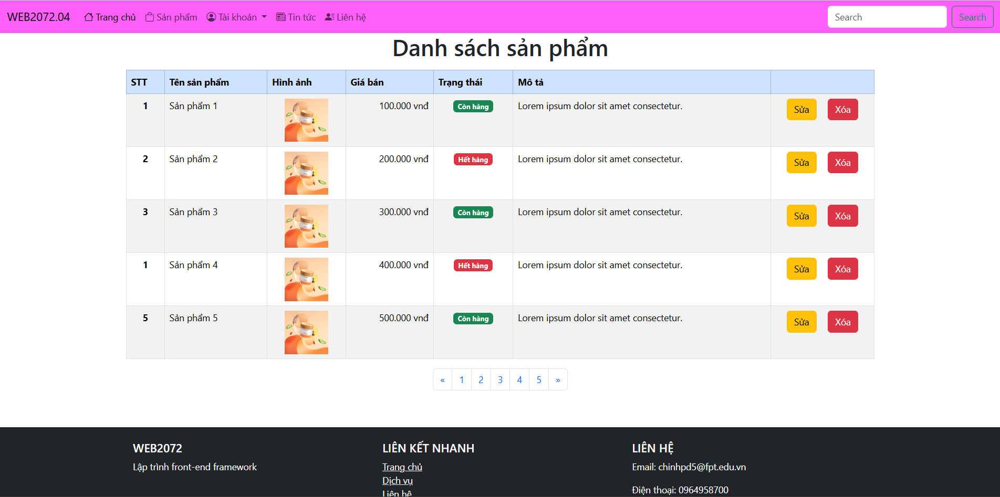
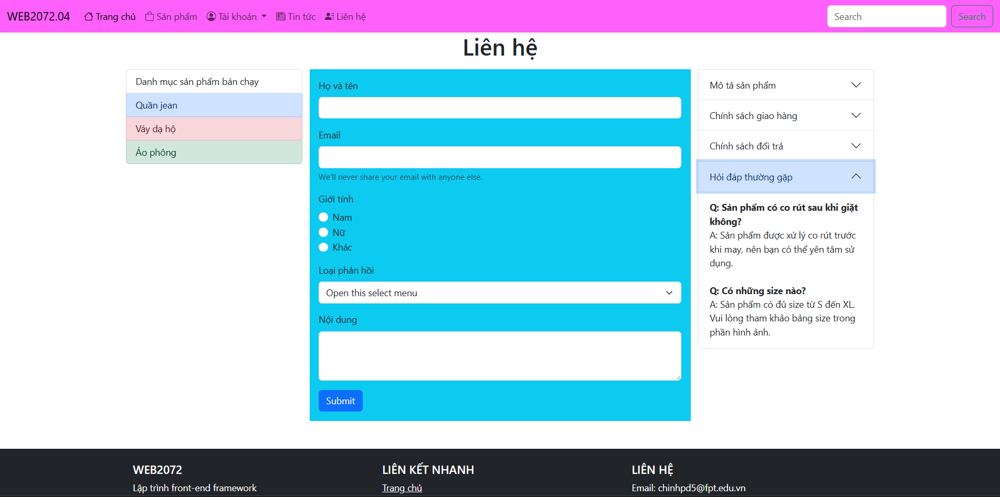

# Lab - Thực hành xây dựng giao diện bằng bootstrap

Yêu cầu:
- Tạo file `lesson3-product.html` và` lession3-contact.html`
- Sử dụng `bootstrap` xây dựng giao diện:
+ `lesson3-product.html`: Danh sách sản phẩm bằng `table`
+ `lession3-contact.html`: Form liên hệ bằng `form`

Gợi ý các `component`: 
- `lesson3-product.html`:
+ tables
+ Pagination
+ button
+ badge - tạo nền màu cho chữ

- `lession3-contact.html`:
+ forms (input, radio, select,...)
+ List group (menu trái)
+ Accordion (menu phải)

## Giao diện trang sản phẩm

## Giao diện trang liên hệ
